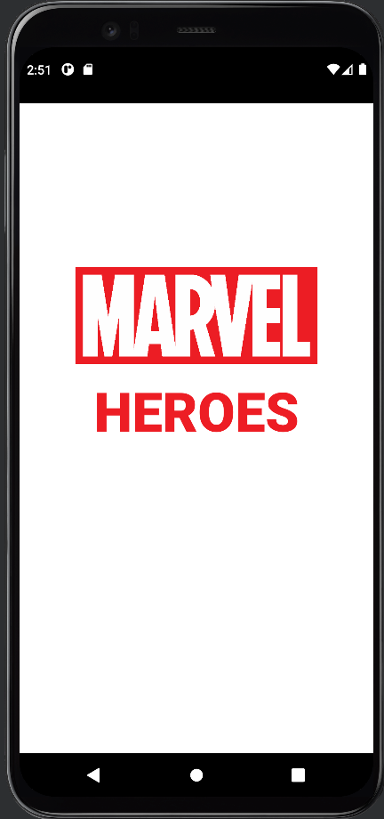
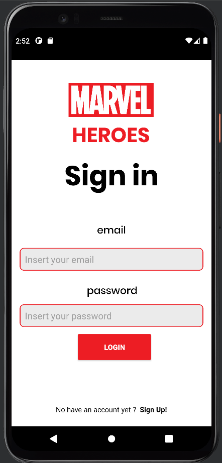
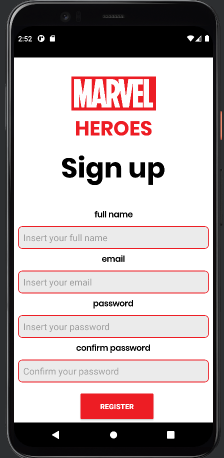
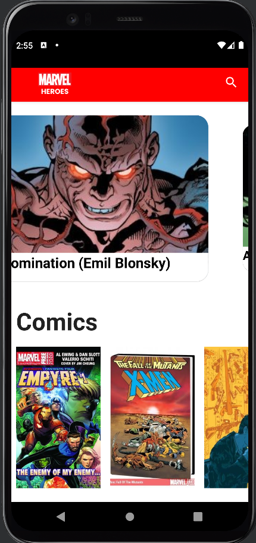
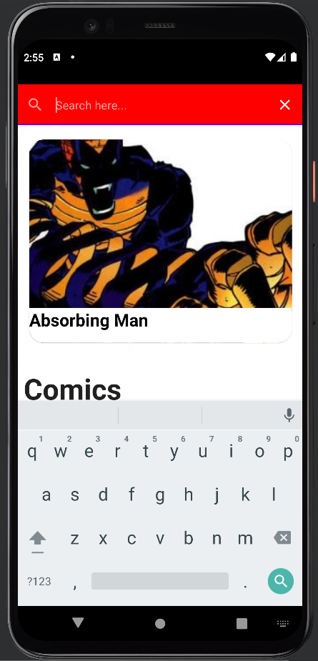

<h1 align="center">
 
  
 
 
MarvelHeroes app built with Kotlin
</h1>

The app develops with Kotlin using the Marvel API with the main function to present the stories, series, and characters of Marvel Studios.  The app is still under development but can be used right now with the initial functionalities. 

## Screenshots

  
  
  

  
  
  

## Development Roadmap

- [x] [Kotlin](https://kotlinlang.org/)
- [x] [LiveData](https://developer.android.com/topic/libraries/architecture/livedata)
- [x] [Navigation](https://developer.android.com/topic/libraries/architecture/navigation)
- [x] [ViewModel](https://developer.android.com/topic/libraries/architecture/viewmodel)
- [ ] [Room](https://developer.android.com/topic/libraries/architecture/room)
- [x] [MVVM](https://medium.com/android-dev-br/arquiteturas-em-android-mvvm-kotlin-android-architecture-components-databinding-lifecycle-d5e7a9023cf3)
- [x] [Service Pattern](https://java-design-patterns.com/patterns/service-layer/)
- [x] [Android Architecture Components](https://medium.com/android-dev-br/arquiteturas-em-android-mvvm-kotlin-android-architecture-components-databinding-lifecycle-d5e7a9023cf3)
- [x] [Coroutines](https://developer.android.com/topic/libraries/architecture/coroutines)
- [x] [Marvel API](https://developer.marvel.com/docs)
- [ ] [Gradle Kotlin DSL](https://docs.gradle.org/current/userguide/kotlin_dsl.html)
- [x] [Databinding](https://developer.android.com/topic/libraries/data-binding)
- [x] [Retrofit](https://square.github.io/retrofit/)
- [x] [Dagger Hilt](https://dagger.dev/hilt/)
- [x] [Google Firebase](https://firebase.google.com/docs)
- [x] [SOLID](https://medium.com/backticks-tildes/the-s-o-l-i-d-principles-in-pictures-b34ce2f1e898)
- [x] [OOP](https://developer.mozilla.org/pt-BR/docs/Glossary/OOP) 
- [ ] [Ktlint](https://ktlint.github.io/)
- [ ] JUnit
- [ ] MotionLayout
- [ ] Transition Animations
- [ ] DayNight
- [x] [Jetpack Compose](https://developer.android.com/jetpack/compose)
- [x] [Paging Compose](https://developer.android.com/jetpack/androidx/releases/paging)
- [x] [Build Variants - UNDER DEVELOPMENT](https://developer.android.com/studio/build/build-variants)

## Features

- [x] Home
- [x] Login
- [x] Register
- [x] AutoSliding
- [x] Search [UNDER DEVELOPMENT]
- [ ] Icon info - Series
- [ ] Icon info - About
- [ ] Icon info- Events
- [ ] Icon info - Stories
- [ ] UserScreen

## Design

- Development with Figma [LINK](https://www.figma.com/file/VZ55Is7X2dR6yPwrPsZsNK/MarvelApp?node-id=136%3A2)
